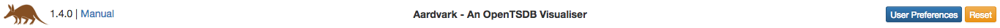
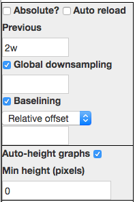

# Aardvark User Guide

Aardvark is a general purpose visualiser for OpenTSDB. Its aim is to provide a simple yet rich user interface to explore 
time series data, however given the wealth of features available, some guidance is necessary in order to be able to get 
the best out of Aardvark.

## Overview

The Aardvark user interface is split up into 6 main areas:

    
* Title area - Identifies version, link to (this) user guide, reset and user preferences
* Global control - Date/time selection, reloading, global downsampling
* Graph controls - Per graph settings
* Graph display - Graphs are rendered here
* Metric selection - Metric discovery, selection populates metric control
* Metric control - Selection of metric query parameters, mapping to graphs
    
## Common concepts

### Time periods

Various fields allow the specification of time periods. Aardvark uses the same shorthand format as OpenTSDB consisting of a number followed by a character:

* **ms** - milliseconds
* **s** - seconds
* **m** - minutes
* **h** - hours
* **d** - days
* **w** - weeks
* **n** - months
* **y** - years

### Date/time formats

* **Date** - yyyy/mm/dd
* **Time** - HH:MM:SS
    
## Title Area

Aside from providing a thin header, this provides access to reset the entire app to a blank status, and links to the manual and user preferences.

* **Reset** - Removes all metrics and graphs, adds back in a single graph with the default settings.

### User Preferences

This dialog provides the ability to customize the Aardvark interface to your own tastes. Changes here are persisted in browser storage.

* **Auto re-render on change** - By default Aardvark only renders graphs when clicking *Save* within either the graph or metric controls or pressing the enter key whilst focus is on a field. However to provide a more dynamic interface you may select this option in order to render on change of any input on the screen.

## Global Controls

These are controls which affect either the whole page, all graphs, or all metrics.

### Date/time controls

Aardvark allows time to be specified as either relative or absolute.

When time is relative, then all you need provide is a period to look back over from now.
 
When time is absolute, then you must specify a date/time to begin and you may optionally specify a date/time to end (else now is used).

Aardvark also allows you to auto-reload (rerender) the graphs every entered time period.

### Downsampling

### Baselining

### Graph height

If you have only one graph then this will be stretched to use up all the vertical space on the screen.

Once you have more than one, then you will be provided with more control over how the vertical space is used:
* *Auto graph-height* will ensure a minimum height for each graph and will distribute extra space to each
* *Fixed graph-height* will force the height of each graph to a specific value

## Graph Controls

Aardvark supports rendering multiple graphs for the same time period, with the ability to change render engine, chart style and other options independently for each.

### Graph management

Aardvark defaults to a single graph, the renderer for which can be defaulted via (configuration)[config.html].

New graphs can be added by clicking 'Add graph' at the bottom of the graph controls panel.

Individual graphs offer the opportunity to change the title, renderer and also to delete it.

Additions and deletions of graphs are not applied to the render view until 'Save' has been pressed, regardless of render mode. All other changes apply according to the render mode.

### Gnuplot renderer

The gnuplot renderer uses OpenTSDB to render timeseries charts on the server and the controls available mirror those found on the default OpenTSDB user interface.

### Horizon renderer

The horizon renderer uses Cubism from Square.io to render horizon charts, horizon charts are particularly useful for spotting event correlations across a large number of timeseries.
 
The horizon renderer allows you to exclude negative values from the plot and apply linear interpolation to gaps between points.

### Dygraph renderer

The dygraph renderer uses Dygraph to provide client-side rendered time series charts with additional capabilities and flexibility over those provided by gnuplot.

#### Rendering controls

#### y-Axis controls

#### Annotations

#### Filtering controls

#### Specials

### Scatter renderer

The scatter renderer uses Dygraph to plot metrics against each other, this is particularly useful for determining strength or manner of correlation.

The scatter renderer requires exactly 2 time series to be able to render and will show a point for a point in time where a value exists for both plotted series. If you have time series which don't often have points at the same time you may find downsampling will help.

Control over the scatter renderer is currently limited to:
* Squash negatives - if a negative is found in either series' value for a point then the point will be excluded.
* Swap axes - changes metric assignment between the 2 axes. 

### Heatmap renderer

The heatmap renderer uses D3 to render calendar based grids showing the magnitude of a timeseries over time, it is well suited to identifying recurring time-based events.

The heatmap renderer requires exactly 1 time series to be able to render.

The style of calendar grid is selectable between:
* Automatic - Selects week columns and day cells for periods over one year, day columns and hour cells otherwise
* Week columns, day cells - shows a row per year with months highlighted
* Day columns, hour cells - shows a grid per month
 
Filtering allows you to exclude values outside the selected range from the range of values included in the colour scheme, allowing you to see finer differences. Cells excluded by the filter are rendered in an off colour to distinguish from cells with no value.
 
The heatmap renderer also allows you to exclude negative values from the plot and to choose your colour scheme.

## Graph Display

This area displays the rendered graphs. For most renderers it is possible to interact with the charts.

### Gnuplot renderer

The gnuplot renderer doesn't provide any opportunities for interaction with a chart.

### Horizon renderer

The horizon renderer doesn't provide any opportunities for interaction with a chart.

It will however show series' values on hover along with a vertical bar allowing you to easily see correlations with other series.

### Dygraph renderer

The dygraph renderer offers some basic controls to interact with your graph:
* Click and drag to zoom in either axis
* Hold down Alt, click and drag to move along the x-axis

Additionally, there are some extra capabilities around annotations:
* Hovering over an existing annotation will display it's summary text
* Clicking an annotation will pop up a dialog allowing you to edit certain properties of the annotation
* Holding Ctrl (or Cmd on OSX) and clicking a point on a time series line will pop up a dialog allowing you to add an annotation

### Scatter renderer

The scatter renderer uses the same chart library as the dygraph renderer and so offers the same interaction options:
* Click and drag to zoom in either axis
* Hold down Alt, click and drag to move along the x-axis

### Heatmap renderer

The heatmap renderer doesn't provide any opportunities for interaction with a chart.

It will however show cell values on hover.

## Metric Selection

Aardvark allows selection of metrics to graph via a tree view which is constructed from the set of available metrics on your instance on OpenTSDB, splitting using the "." character.

Select a metric to graph by selecting an underlined node, which may be present at any level (not just leaf nodes).

The 

## Metric Controls

ipso lorem...